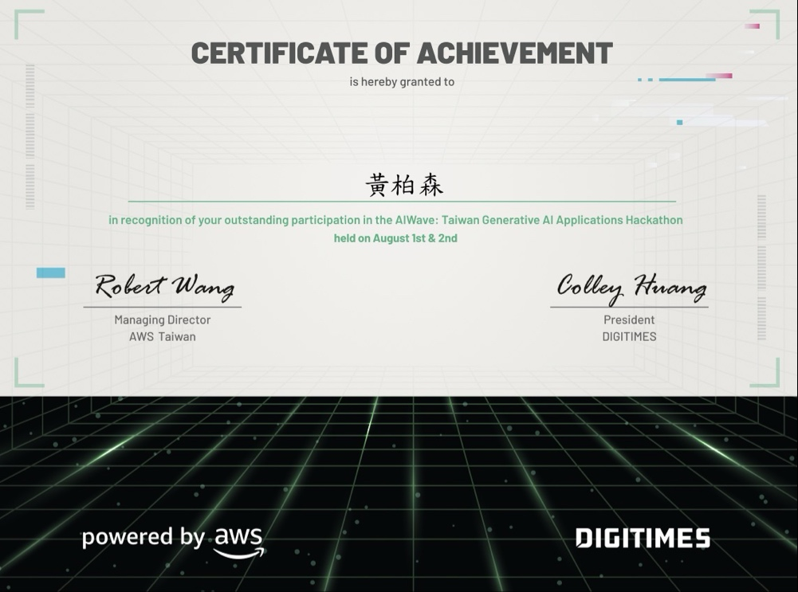
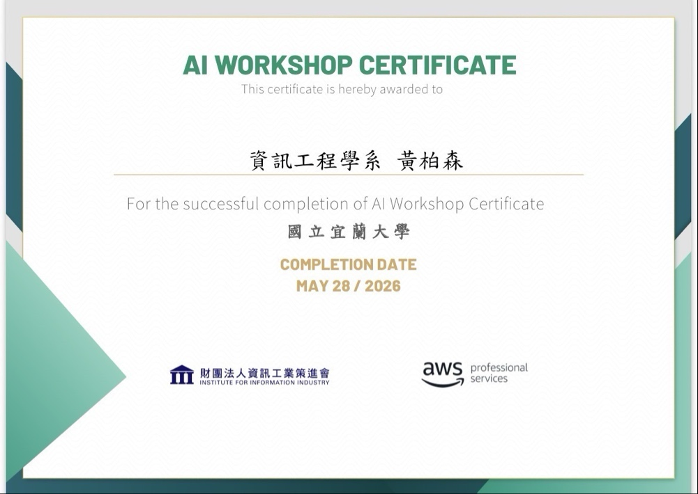

# Boson 作品集

**Languages:** [English](README.md) · [中文](README.zh-TW.md)

**線上：** <https://boson316.github.io/portfolio/>  
**English：** <https://boson316.github.io/portfolio/en/>  
**數位名片：** <https://boson316.github.io/portfolio/card/> · QR：[`card/qr.png`](card/qr.png)

---

資工系大二作品集 — 前端、AI 應用、RTX 3050 GPU/CUDA 優化實驗室。

[](assets/AIWave_Hackathon_Certificate.png)
[](assets/AI_Workshop_Certificate.png)

## 網站功能

單頁作品集（GitHub Pages），中英雙語介面與互動區塊：

| 區塊 | 錨點 | 重點 |
|------|------|------|
| 首頁 | `#hero` | 自我介紹 · **和 AI 聊聊** 按鈕 |
| 3D 技能雲 | `#skills` | 六類技能 · Three.js 球體 |
| 專案精選 | `#projects` | 七張專案卡片 |
| ML 專區 | `#ml-showcase` | 威斯康辛乳腺癌 · KNN ~**94.7%** · 五張 Chart.js 圖表 |
| GPU 專區 | `#gpu-showcase` | RTX 3050 benchmark — matmul **521×**、MNIST **99%** |
| 認證 | `#credentials` | AWS AIWave + AI Workshop（lightbox 放大） |
| 聯絡 | `#contact` | 信箱 · AI 助手 |

另有：**暗黑模式**（導覽列切換）、Chart.js / Three.js 延遲載入、RWD 排版。

## AI 助手（雙 FAB）

右下角兩顆浮動按鈕 — 同一個 **小boson** 人設，後端不同：

| FAB | 面板 | 後端 |
|-----|------|------|
| **3D**（紫色） | `#perxonaPanel` · Perxona 虛擬人 | [Perxona Live](https://live.perxona.ai/asia/boson316/littleboson) iframe（預設）· SDK + Render proxy 備援 |
| **💬**（橘色） | `#chatPanel` · 文字 + 快捷 chips | Groq · `POST /api/chat`（[Render API](https://perxona.onrender.com)） |

- **apiKey 永不進前端** — 機密只在 Render（`api/`）。
- 3D 知識：Perxona Dashboard Storyboard + 上傳 `perxona-knowledge-base.txt`。
- 文字聊天知識：`api/app.py` 的 `SYSTEM_PROMPT`（Groq）。

完整整合說明：[`PERXONA.md`](PERXONA.md) · 後端：[`api/README.md`](api/README.md)

## 認證與戰果

| 證書 | 頒發單位 | 日期 |
|------|----------|------|
| **AIWave: Taiwan Generative AI Applications Hackathon** | AWS Taiwan × DIGITIMES | 2026 年 8 月 |
| **AI Workshop Completion** | AWS Professional Services × 資策會（宜大） | 2026 年 5 月 |

<p align="center">
  <a href="assets/AIWave_Hackathon_Certificate.png">
    
  </a>
</p>

> 兩日生成式 AI 黑客松完賽；Agentic AI、FastAPI 整合、模型部署實戰。  
> 線上展示：[作品集認證專區](https://boson316.github.io/portfolio/#credentials)

<details>
<summary><b>檢視 AI Workshop 證書</b></summary>
<br>



</details>

## 數位名片

一個短網址／QR，方便分享；頁面含 **FB、IG、LinkedIn、YouTube（生活／財金）、方格子** 社群 icon 列：

| 入口 | 連結 |
|------|------|
| 名片頁 | <https://boson316.github.io/portfolio/card/> |
| 作品集 | <https://boson316.github.io/portfolio/> |
| GitHub Profile | <https://github.com/boson316> |
| FinTools（年化／退休計算機） | <https://boson316.github.io/niu/annual_return_calculator_v5.html> |
| Facebook | <https://www.facebook.com/boson.huang.960102> |
| Instagram | <https://www.instagram.com/boson_0727/> |
| LinkedIn | <https://www.linkedin.com/in/boson-huang-334b03303/> |
| YouTube · 生活 | <https://www.youtube.com/@boson0777> |
| YouTube · 財金 | <https://www.youtube.com/@Boson0727> |
| 方格子部落格 | <https://vocus.cc/user/@Boson> |
| Email | poboson316@gmail.com |

掃碼或開啟：<https://boson316.github.io/portfolio/card/> · QR：[`card/qr.png`](card/qr.png)

## 專案

| 專案 | 連結 |
|------|------|
| GPU Optimization Lab | [GitHub](https://github.com/boson316/RTX3050-GPU-Mastery) · [GPU 專區](https://boson316.github.io/portfolio/#gpu-showcase) |
| 年化報酬率／退休規劃計算機 | [退休 v5](https://boson316.github.io/niu/annual_return_calculator_v5.html) · [年化 v4](https://boson316.github.io/niu/annual_return_calculator_v4.html) · [GitHub](https://github.com/boson316/niu) |
| 新聞蒐集系統 | [Live](https://boson-news-app.onrender.com/) · [GitHub](https://github.com/boson316/news) |
| 校園美食地圖 v2（宜大） | [Live](https://food-map-niu-v2.streamlit.app/) · [GitHub](https://github.com/boson316/food_map_niu_v2) |
| 人工智慧 × 資料科學互動圖表 | [ML 專區](https://boson316.github.io/portfolio/#ml-showcase) |
| RAG 知識庫聊天 | 開發中 |

**聯絡：** poboson316@gmail.com

## Repo 結構

```
portfolio/
├── index.html, en/          # GitHub Pages（靜態前端）
├── card/                    # 數位名片（社群 icon + 連結）
├── script.js                # 💬 Groq 文字聊天
├── perxona-config.js        # Agent ID、API URL（無 secret）
├── perxona-embed.js         # 3D Perxona 嵌入 + Live iframe
├── perxona-knowledge-base.* # 3D avatar 知識庫（Dashboard 上傳 .txt）
├── PERXONA.md               # Perxona + Groq 整合說明
└── api/                     # Render 後端（Root Directory: api）
    ├── app.py               # health、chat、perxona-token、perxona-proxy
    └── README.md
```

## 本機預覽

**前端（靜態）：**

```bash
cd c:\Users\User\Documents\code\cursor\3_Web與API\portfolio
npx serve .
# 名片：http://localhost:3000/card/
# 英文：http://localhost:3000/en/
```

**後端（選用 — 本機跑 💬 聊天與 3D token）：**

```powershell
cd api
Copy-Item .env.example .env   # 填入 GROQ_API_KEY、PERXONA_API_KEY
pip install -r requirements.txt
python app.py                 # http://127.0.0.1:5000
```

瀏覽器 console 設 `window.PORTFOLIO_API_URL = 'http://127.0.0.1:5000'`，或改 `perxona-config.js` 指向本機 API。
